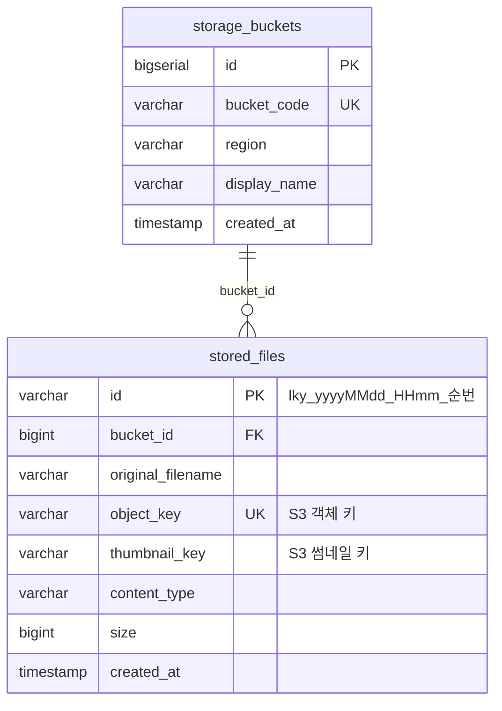
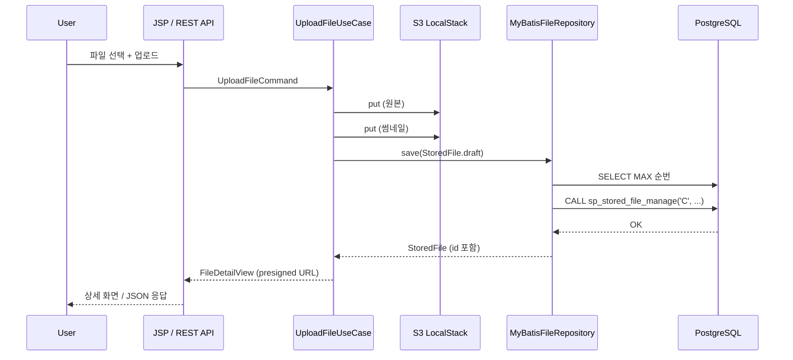
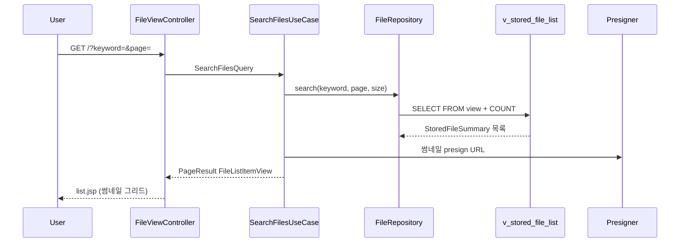

# logstack_s3

Spring Boot 기반 **파일 업로드·관리** 샘플 프로젝트입니다.  
실제 파일은 **S3(LocalStack)** 에 저장하고, 메타데이터는 **PostgreSQL** 에 보관합니다.  
화면은 **JSP/JSTL**, API 문서는 **Swagger**, DB 접근은 **MyBatis + 저장 프로시저(CUD)** 로 구성했습니다.

---

## 목차

1. [기능 요약](#기능-요약)
2. [기술 스택](#기술-스택)
3. [아키텍처](#아키텍처)
4. [왜 이렇게 개발했는가](#왜-이렇게-개발했는가)
5. [ERD](#erd)
6. [파일 ID 규칙](#파일-id-규칙)
7. [DB 접근 전략](#db-접근-전략)
8. [프로젝트 흐름](#프로젝트-흐름)
9. [API](#api)
10. [화면 URL](#화면-url)
11. [로컬 실행](#로컬-실행)
12. [테스트](#테스트)
13. [디렉터리 구조](#디렉터리-구조)

---

## 기능 요약

| 기능 | 설명 |
|------|------|
| 파일 업로드 | Multipart → S3 저장 + DB 메타데이터 등록 |
| 목록/검색 | 페이징, 파일명 키워드 검색, 썸네일 그리드 |
| 상세/미리보기 | 이미지·PDF 인라인 미리보기, Presigned 다운로드 URL |
| 파일 삭제 | DB 메타 삭제 (프로시저 D) |
| 대용량 체험 | 관리 API로 데모 데이터 대량 INSERT |
| Swagger | REST API 테스트 UI |

---

## 기술 스택

| 구분 | 기술 |
|------|------|
| Language | Java 25 |
| Framework | Spring Boot 4.0.6 |
| View | JSP + JSTL, CSS/JS 분리 (`static/`) |
| DB | PostgreSQL |
| ORM | MyBatis 3.0.5 |
| Object Storage | AWS SDK S3  |
| 썸네일 | ImageIO, Apache PDFBox |
| API Doc | openapi  |
| Build | Gradle (Kotlin DSL) |
| Test | JUnit 5, Mockito, AssertJ |

---

## 아키텍처

레이어드 아키텍처 + DDD 스타일로 패키지를 나눴습니다.  
**의존 방향은 항상 안쪽(domain)을 향합니다.**

```text
┌─────────────────────────────────────────────────────────────┐
│  interfaces (Presentation)                                   │
│  ├─ web/          JSP MVC (FileViewController)               │
│  └─ api/          REST + Swagger (FileApiController)         │
└───────────────────────────┬─────────────────────────────────┘
                            │ UseCase 호출
┌───────────────────────────▼─────────────────────────────────┐
│  application (Application)                                   │
│  ├─ usecase/      Upload, Search, GetDetail, Delete, Seed    │
│  ├─ port/         ObjectStoragePort, ThumbnailPort           │
│  ├─ query/        Command 객체 (UploadFileCommand 등)        │
│  ├─ view/         API·화면용 Read Model                      │
│  └─ assembler/    Domain → View 변환                         │
└───────────────────────────┬─────────────────────────────────┘
                            │ Port / Repository 인터페이스
┌───────────────────────────▼─────────────────────────────────┐
│  domain (Domain)                                             │
│  ├─ model/        StoredFile, PageResult (record)            │
│  ├─ repository/   FileRepository (인터페이스)                  │
│  ├─ service/      FileIdGenerator, FileKeyFactory            │
│  └─ exception/    FileNotFoundException 등                   │
└───────────────────────────▲─────────────────────────────────┘
                            │ 구현
┌───────────────────────────┴─────────────────────────────────┐
│  infrastructure + config                                     │
│  ├─ persistence/  MyBatis, MyBatisFileRepository             │
│  ├─ storage/s3/   S3ObjectStorageAdapter                     │
│  ├─ thumbnail/    PdfBoxThumbnailAdapter                     │
│  global/          환경설정·공통 유틸 (config, common)          │
│  └─ config/       S3Config, JspWebConfig, OpenApiConfig      │
└─────────────────────────────────────────────────────────────┘
```

### 레이어별 역할

| 레이어 | 책임 |
|--------|------|
| **interfaces** | HTTP 진입점. 비즈니스 로직 없음. |
| **application** | 유스케이스 오케스트레이션. `UseCase<I,O>` 함수형 인터페이스. |
| **domain** | 핵심 규칙·모델·저장소 **인터페이스**. 프레임워크 비의존. |
| **infrastructure** | MyBatis, S3, PDFBox 등 **구현체**. |
| **common** | 한국어 메시지 등 공통 상수. |

---

## 왜 이렇게 개발했는가

### 1. S3 + DB 분리

- **바이너리**는 S3에 두고, **검색·목록에 필요한 메타**만 DB에 둡니다.
- LocalStack으로 로컬에서 AWS S3 API를 그대로 연습할 수 있습니다.
- 운영 전환 시 `application-local.yml` 의 endpoint만 바꾸면 됩니다.

### 2. MyBatis + 프로시저(CUD) + 뷰(목록)

| 작업 | 방식 | 이유 |
|------|------|------|
| C / U / D | `sp_stored_file_manage` | DB에서 변경 로직을 한곳에 모음 |
| 단건 조회 | `stored_files` 테이블 | 단순·빠른 PK 조회 |
| 목록/검색 | `v_stored_file_list` 뷰 | 버킷 JOIN, `size_label`, `media_type` 등 표시용 컬럼을 SQL에서 처리 |

프로시저는 **CUD만** 담당하고, SELECT·순번 조회는 MyBatis XML에서 처리합니다.

### 3. 커스텀 파일 ID

- `BIGSERIAL` 대신 **`lky_{yyyyMMdd}_{HHmm}_{순번}`** 형태를 사용합니다.
- 저장 **직전** 같은 분(minute) prefix로 `MAX(순번)` 조회 후 +1 부여합니다.
- 9999 다음은 `10000`처럼 4자리를 넘어서도 자동 확장됩니다.

### 4. DDD + 함수형 스타일

- **record**로 불변 도메인 모델 (`StoredFile`, `PageResult`).
- **Port**로 S3·썸네일을 추상화 → 테스트 시 Mock 교체 용이.
- **UseCase** 단위로 기능을 쪼개 REST/JSP가 같은 로직을 공유합니다.

### 5. JSP include + 정적 리소스 분리

- `includes/head.jsp`, `header.jsp`, `layout-top/bottom.jsp` 로 공통 UI 유지.
- CSS(`static/css/app.css`), JS(`static/js/app.js`) 분리.

### 6. 한국어 에러·로그

- API 응답 `message`, 로그, 화면 플래시 메시지를 한국어로 통일했습니다.

---

## ERD



### 테이블 설명

**storage_buckets**

- S3 버킷 메타(코드, 리전, 표시명).
- 기본 시드: `erp-bucket` / `us-east-1`.

**stored_files**

- 업로드 파일 1건당 1행.
- `object_key`, `thumbnail_key` 는 S3에 실제로 올라간 키.
- `id` 는 애플리케이션에서 부여

**v_stored_file_list** (뷰)

- `stored_files` ⟕ `storage_buckets` JOIN.
- 목록 화면용: `bucket_display_name`, `size_label`, `media_type`(IMAGE/PDF/FILE).

---

## 파일 ID 규칙

```text
{prefix}_{yyyyMMdd}_{HHmm}_{순번}
```

예시:

| 상황 | ID |
|------|-----|
| 2026-05-20 14:30 첫 업로드 | `lky_20260520_1430_0001` |
| 같은 분 두 번째 | `lky_20260520_1430_0002` |
| 14:31 첫 업로드 | `lky_20260520_1431_0001` |
| 9999번 다음 | `lky_20260520_1430_10000` |

설정: `logstack.file-id.prefix` (기본값 `lky`)

순번 조회 SQL (개념):

```sql
SELECT COALESCE(MAX(CAST(SPLIT_PART(id, '_', 4) AS BIGINT)), 0)
FROM stored_files
WHERE id LIKE 'lky_20260520_1430_%';
```

---

## DB 접근 전략

```text
┌──────────────┐     selectMaxSequence      ┌─────────────┐
│  Application │ ─────────────────────────► │  PostgreSQL │
│  (Java)      │     call sp ... 'C'        │  + MyBatis  │
└──────────────┘ ◄───────────────────────── └─────────────┘
       │              ID 부여 후 INSERT
       ▼
┌──────────────┐
│  LocalStack  │  putObject / presign
│  S3          │
└──────────────┘
```

| MyBatis 메서드 | 대상 | 용도 |
|----------------|------|------|
| `selectMaxSequence` | `stored_files` | 저장 전 순번 조회 |
| `callManage` | `sp_stored_file_manage` | C / U / D |
| `selectById` | `stored_files` | 단건 조회 |
| `selectPageFromView` | `v_stored_file_list` | 목록 + 페이징 |
| `countFromView` | `v_stored_file_list` | 검색 total count |

프로시저 연산:

| `p_operation` | 의미 |
|---------------|------|
| `C` | INSERT (ID는 Java에서 생성 후 전달) |
| `U` | UPDATE |
| `D` | DELETE |

---

## 프로젝트 흐름

### 업로드 (전체)



### 목록 조회



### 상세 / 미리보기

1. `GET /files/{id}` 또는 `GET /api/files/{id}`
2. `stored_files` 테이블에서 단건 조회
3. S3 Presigned URL 생성 → 이미지 ``, PDF `<iframe>`, 기타는 다운로드 링크

---

## API

Swagger UI: **http://localhost:8080/swagger-ui.html**

| Method | Path | 설명 |
|--------|------|------|
| `POST` | `/api/files/upload` | 파일 업로드 (multipart `file`) |
| `GET` | `/api/files` | 목록 (`page`, `size`, `keyword`) |
| `GET` | `/api/files/{id}` | 상세 (preview/download URL 포함) |
| `DELETE` | `/api/files/{id}` | 삭제 |
| `POST` | `/api/admin/seed?count=10000` | 데모 데이터 대량 생성 |

에러 응답 예:

```json
{
  "message": "파일을 찾을 수 없습니다. (id=lky_20260520_1430_9999)"
}
```

---

## 화면 URL

| URL | 설명 |
|-----|------|
| http://localhost:8080/ | 파일 목록 (검색·페이징·썸네일) |
| http://localhost:8080/upload | 업로드 폼 |
| http://localhost:8080/files/{id} | 상세·미리보기 |

---

## 로컬 실행

### 사전 요구

1. **PostgreSQL** — DB `logstack_s3` 생성
2. **LocalStack** — S3 (포트 `4566`)
3. **Java 25**, Gradle

### PostgreSQL

```sql
CREATE DATABASE logstack_s3;
```

앱 기동 시 `src/main/resources/schema.sql` 이 자동 실행됩니다 (`spring.sql.init.mode=always`).

### LocalStack (예시)

```text
endpoint = http://localhost:4566
region   = us-east-1
accessKey = debuggeandoideas
secretKey = secret
bucket   = erp-bucket
```

`application-local.yml` 에 동일 설정이 있습니다.

### 실행

```powershell
cd d:\intel\Spring_lee_Module\logstack_s3
$env:SPRING_PROFILES_ACTIVE="local"
.\gradlew.bat bootRun
```

### 업로드 확인 (AWS CLI + LocalStack)

```powershell
$env:AWS_ACCESS_KEY_ID="debuggeandoideas"
$env:AWS_SECRET_ACCESS_KEY="secret"
$env:AWS_DEFAULT_REGION="us-east-1"
aws --endpoint-url=http://localhost:4566 s3 ls s3://erp-bucket/uploads/
```

---

## 테스트

```powershell
.\gradlew.bat test
```

- **39개** 단위·API 테스트 (Given-When-Then 구조)
- 레이어별: `domain`, `application`, `infrastructure`, `interfaces`
- DB/S3 없이 Mock 기반 실행

리포트: `build/reports/tests/test/index.html`

---

## 디렉터리 구조

```text
logstack_s3/
├── build.gradle.kts
├── settings.gradle.kts
├── README.md
└── src/
    ├── main/
    │   ├── java/.../logstack_s3/
    │   │   ├── domain/           # 모델, 규칙, Repository 인터페이스
    │   │   ├── application/      # UseCase, Port, View, Assembler
    │   │   ├── infrastructure/   # MyBatis, S3, Thumbnail 구현
    │   │   ├── interfaces/       # web(JSP), api(REST)
    │   │   └── global/           # 환경설정·공통
    │   │       ├── config/       # S3, JSP, OpenAPI
    │   │       └── common/       # KoreanMessages
    │   ├── resources/
    │   │   ├── application.yml
    │   │   ├── application-local.yml
    │   │   ├── schema.sql
    │   │   ├── mapper/StoredFileMapper.xml
    │   │   └── static/css, js/
    │   └── webapp/WEB-INF/views/
    │       ├── includes/         # head, header, layout
    │       ├── list.jsp
    │       ├── upload.jsp
    │       └── detail.jsp
    └── test/                     # Given-When-Then 단위 테스트
```

---

## 설정 참고

| 키 | 설명 | 기본 |
|----|------|------|
| `logstack.file-id.prefix` | 파일 ID 접두어 | `lky` |
| `logstack.default-bucket-id` | DB `storage_buckets.id` | `1` |
| `aws.s3.presign-duration-minutes` | Presigned URL 유효 시간(분) | `60` |
| `spring.servlet.multipart.max-file-size` | 업로드 최대 크기 | `10MB` |

---

## 라이선스 / 참고

배포전 학습용 미니 프로젝트입니다. 운영 배포 시 시크릿 관리, 트랜잭션 경합(동시 업로드 시 ID 중복 방지), S3 IAM Role 적용 등을 추가 검토하세요.
