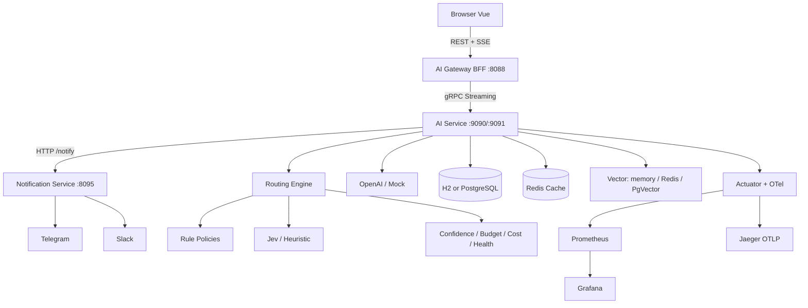

# SearchAI — AI Gateway & Intelligent Model Router

RAG + SSE 스트리밍 채팅을 **운영형 AI Gateway / Cost Control Platform**으로 확장한 프로젝트입니다.

> 채팅 권한은 유지됩니다: `USER`=직접 대화, `ADMIN`=채팅+PDF+지식베이스+인터넷검색 (+통계·정책).

**Java 27 · Spring Boot 4.1.1 · Gradle KTS · gRPC · SSE · Resilience4j · Micrometer/OTel · Prometheus/Grafana · Vue 3**

---

## 문제 정의

| 문제 | 대응 |
|------|------|
| 모든 요청을 고성능 모델에 전송 | Hybrid Rule + Jev Router |
| Routing 자체 비용 | Rule Policy로 단순 요청 처리 |
| Model 장애 → 전체 장애 | Retry / CircuitBreaker / Fallback |
| Token/비용 폭증 | Budget Soft/Warn/Hard + Downgrade |
| 이상 사용 | Multiplier / StdDev Anomaly Strategy |
| 관측 불가 | Actuator + Prometheus + Grafana + OTel/Jaeger |

## Architecture



```text
Browser ↔ Gateway = REST + SSE
Gateway ↔ AI Service = gRPC
AI Service ↔ Notification = HTTP relay (optional)
```

프로세스 경계 (현재):

| 프로세스 | 포트 | 역할 |
|----------|------|------|
| `gateway` | 8088 | BFF, JWT, SSE |
| `ai-service` | 9090 gRPC / 9091 HTTP | Router, RAG, Usage, Mock AI |
| `notification` | 8095 | Telegram/Slack fan-out |

model-router / usage / rag는 **ai-service 내부 패키지 경계**로 유지합니다. (불필요 MSA 강제 분리 없음)

## Config 분리

| 파일 | 역할 |
|------|------|
| `application.yml` | 코어 + `spring.config.import` |
| `application-models.yml` | Model Tier 가격 |
| `application-resilience.yml` | Fallback + Resilience4j |
| `application-usage.yml` | Budget + Plan |
| `application-notification.yml` | Telegram/Slack/Relay |
| `application-openai.yml` | OpenAI + Redis vector |
| `application-pgvector.yml` | PostgreSQL + PgVector |
| `application-virtual.yml` | Virtual Threads |

## Soft / Hard Budget

| 구간 | 동작 |
|------|------|
| &lt;80% | NORMAL |
| ≥80% Soft | Warning + SOL 이하 |
| ≥90% Warn | TERRA 이하 |
| ≥100% Hard | 외부 LLM 제한, FAQ/DB 유지 |

## Notification

```powershell
# 별도 프로세스
.\gradlew.bat :notification:bootRun

# ai-service에서 relay 사용
$env:NOTIFY_RELAY_ENABLED="true"
# 또는 직접
$env:NOTIFY_TELEGRAM_ENABLED="true"
$env:TELEGRAM_BOT_TOKEN="..."
$env:TELEGRAM_CHAT_ID="..."
$env:NOTIFY_SLACK_ENABLED="true"
$env:SLACK_WEBHOOK_URL="..."
```

## Observability

- Prometheus: http://localhost:9091/actuator/prometheus
- Grafana: http://localhost:3000
- Jaeger UI: http://localhost:16686 (OTLP `:4318`)

## PgVector

```powershell
docker compose up -d postgres
.\gradlew.bat :ai-service:bootRun --args='--spring.profiles.active=openai,pgvector'
```

## k6

```powershell
k6 run searchai/k6/normal-chat.js
k6 run searchai/k6/streaming-chat.js
k6 run searchai/k6/concurrency-test.js
k6 run searchai/k6/rate-limit-test.js
k6 run searchai/k6/budget-limit-test.js
k6 run searchai/k6/ai-failure-test.js
```

## 실행

```powershell
cd searchai
docker compose up -d
.\gradlew.bat :ai-service:bootRun
.\gradlew.bat :gateway:bootRun
.\gradlew.bat :notification:bootRun   # optional
cd frontend; pnpm install; pnpm dev
```

- App: http://localhost:5178 (`admin/admin123`, `user/user123`)

## Mock AI Fault

```text
POST http://localhost:9091/admin/mock-ai/mode/HTTP_503
```

## 호환성

| 항목 | 현재 |
|------|------|
| Java | 27 |
| Spring Boot | 4.1.1 |
| 기본 DB | H2 file (PostgreSQL MODE) |
| PostgreSQL / PgVector | profile `pgvector` |
| Redis | Cache/Vector optional |

채팅·ADMIN PDF/지식/검색 기능은 유지하며 Gateway/Cost/Observability 계층을 확장합니다.
