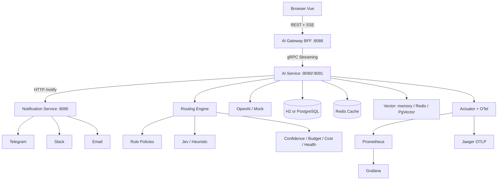

# SearchAI — AI Gateway & Intelligent Model Router

RAG + SSE 스트리밍 채팅을 **운영형 AI Gateway / Cost Control Platform**으로 확장한 프로젝트입니다.

**Java 27 · Spring Boot 4.1.1 · Gradle KTS · gRPC · SSE · Resilience4j · Micrometer/OTel · Prometheus/Grafana · Vue 3**

---

## 문제 정의

| 문제 | 대응 |
|------|------|
| 모든 요청을 고성능 모델에 전송 | Hybrid Rule + Jev Router |
| Routing 자체 비용 | Rule Policy로 단순 요청 처리 |
| Model 장애 → 전체 장애 | Retry / CircuitBreaker / Fallback |
| Token/비용 폭증 | Budget Soft/Warn/Hard + Downgrade |
| 이상 사용 | Multiplier / StdDev Anomaly Strategy |
| 관측 불가 | Actuator + Prometheus + Grafana + OTel/Jaeger |

## 왜 이 스택인가

| 기술 | 이유 |
|------|------|
| **SSE** | 브라우저에 LLM 토큰 스트리밍 |
| **gRPC** | Gateway↔AI 내부 계약·Server Streaming·낮은 직렬화 오버헤드 |
| **Redis** | Response Cache / (옵션) Rate Limit / Vector |
| **PostgreSQL/H2** | Usage·Policy·Audit 영속 (기본 H2, 프로필 `pgvector`로 PG) |
| **Jev** | Prompt → Model Tier 구조화 분류 |
| **Resilience4j** | 외부 AI Provider 장애 격리 |

## Architecture



```text
Browser ↔ Gateway = REST + SSE
Gateway ↔ AI Service = gRPC
AI Service ↔ Notification = HTTP relay (optional)
```

| 프로세스 | 포트 | 역할 |
|----------|------|------|
| `gateway` | 8088 | BFF, JWT, SSE |
| `ai-service` | 9090 gRPC / 9091 HTTP | Router, RAG, Usage, Mock AI |
| `notification` | 8095 | Telegram/Slack/Email fan-out |

model-router / usage / rag는 **ai-service 내부 패키지 경계**로 유지합니다.

## Routing 흐름

```text
Auth → Rate Limit → Classifier → UsagePolicy → Cache
  → Rule / Jev → Confidence → Budget → Cost → Health
  → OpenAI (+ Retry/CB/Fallback) → Usage/Anomaly/Alert
```

- **Rule**: 인사·계산·번역·포맷 등 명확한 요청
- **Jev/Heuristic**: 애매한 요청 (`APP_ROUTER_MODE=jev|heuristic`)
- **Confidence < threshold**: 한 단계 Tier 승격 (무조건 ASTRA 아님)
- **Budget Soft/Warn**: 고가 Tier 강등 / Hard: 외부 LLM 차단(FAQ/DB·Cache HIT 유지)

## Resilience4j

| 기능 | 목적 | 대상 |
|------|------|------|
| Retry | 일시 장애 흡수 | 429, 5xx, Timeout, Connect |
| CircuitBreaker | 장애 모델 격리 | 실패율≥50% → OPEN → HALF_OPEN |
| RateLimiter | Provider 폭주 방지 | 모델별 초당 호출 |
| Bulkhead | 동시성 격리 | 모델별 동시 스트림 |

**Retry 하지 않음:** 400/401/403, 잘못된 Prompt, Circuit OPEN, Bulkhead full.

Fallback 순서: `application-resilience.yml` `app.fallback.routes`.

## Token / Cost Budget

| 구간 | 동작 |
|------|------|
| &lt;80% | NORMAL |
| ≥80% Soft | Warning + SOL 이하 |
| ≥90% Warn | TERRA 이하 |
| ≥100% Hard | 외부 LLM 제한, FAQ/DB·Cache 유지 |

Plan(`FREE`/`PRO`/`ADMIN`)은 `application-usage.yml` — `defaultPlan`과 사용자(`admin`→ADMIN)로 적용.
Rate Limit은 Token Limit과 분리 (`memory` 기본, `USAGE_RATE_LIMIT_BACKEND=redis` 가능).

가격: YAML Model Catalog + `model_price` 테이블(유효기간).

## Config 분리

| 파일 | 역할 |
|------|------|
| `application.yml` | 코어 + import |
| `application-models.yml` | Model Tier 가격 |
| `application-resilience.yml` | Fallback + R4j |
| `application-usage.yml` | Budget + Plan |
| `application-notification.yml` | Telegram/Slack/Email/Relay |
| `application-openai.yml` | OpenAI + Redis vector |
| `application-pgvector.yml` | PostgreSQL + PgVector |
| `application-platform.yml` / `application-virtual.yml` | Thread 비교 |

## Notification

```powershell
.\gradlew.bat :notification:bootRun
$env:NOTIFY_RELAY_ENABLED="true"
$env:NOTIFY_TELEGRAM_ENABLED="true"
$env:NOTIFY_SLACK_ENABLED="true"
$env:NOTIFY_EMAIL_ENABLED="true"
```

## Observability

- Prometheus: http://localhost:9091/actuator/prometheus
- Grafana: http://localhost:3000
- Jaeger: http://localhost:16686
- docs: `docs/incidents/`, `docs/performance/`

## PgVector

```powershell
docker compose up -d postgres
.\gradlew.bat :ai-service:bootRun --args='--spring.profiles.active=openai,pgvector'
```

## k6

```powershell
k6 run searchai/k6/normal-chat.js
k6 run searchai/k6/streaming-chat.js
k6 run searchai/k6/concurrency-test.js
k6 run searchai/k6/rate-limit-test.js
k6 run searchai/k6/budget-limit-test.js
k6 run searchai/k6/ai-failure-test.js
```

## 실행

```powershell
cd searchai
docker compose up -d
.\gradlew.bat :ai-service:bootRun
.\gradlew.bat :gateway:bootRun
.\gradlew.bat :notification:bootRun
cd frontend; pnpm install; pnpm dev
```

- App: http://localhost:5178 (`admin/admin123`, `user/user123`)

## Mock AI Fault

```text
POST http://localhost:9091/admin/mock-ai/mode/HTTP_503
```

Modes: NORMAL, SLOW, HTTP_429, HTTP_500, HTTP_503, TIMEOUT, MALFORMED_RESPONSE

## 호환성

| 항목 | 현재 |
|------|------|
| Java | 27 |
| Spring Boot | 4.1.1 |
| 기본 DB | H2 file (PostgreSQL MODE) |
| PostgreSQL / PgVector | profile `pgvector` |
| Redis | Cache/Vector/RateLimit optional |
| FE | Vue 3 (프롬프트의 React/Next 대신 기존 FE 유지) |
